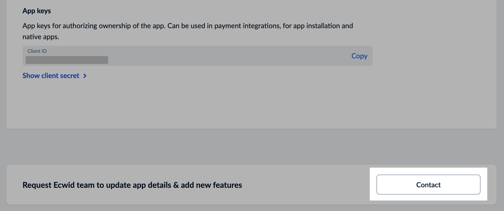

# Contact Ecwid API support team

Whether you’re developing an app for your store or Ecwid App Market, you can always count on our API Support team.&#x20;

### Get assistance with your app

If you need to update app settings or have a question about your app or our API, you can contact the API Support team directly from the app settings page in your Ecwid admin.

[**Open app settings page**](https://my.ecwid.com/#develop-apps)

To submit your app update request or a question:

1. Open settings page for the app you want to get help with.
2. Scroll down and click the **Details** button.
3.  Scroll down to the **Contact** button:\

    <figure><figcaption></figcaption></figure>
4. In the opened **one-field form**, enter your questions or describe the changes you need for your app, then click the **Submit** button.

That’s it!

Once your request is submitted, our API support team will review it and respond **within 24 hours or less** on business days. The request will automatically include your store and application IDs, enabling us to locate your app and verify its current settings. You’ll receive our response via email at the address associated with your store registration.


**Changes to access scopes do not affect existing tokens for apps already installed in a store.**\
\
You’ll need to reinstall the app after receiving an email about the app being updated.&#x20;

To do so:

1. **Uninstall the app** from the [Ecwid admin > My apps](https://my.ecwid.com/#my_apps) page to revoke old tokens.
2. **Install the app back** from the [Ecwid admin > #develop-apps > Details](https://my.ecwid.com/#develop-apps) page to get new tokens with updated permissions.


### Email support

Want to onboard and set up a dev environment with Ecwid? Have a question about the API documentation? Reach out to our API Support team anytime. You’ll receive a response within 1–2 business days.

Already have an Ecwid store and an app? Send us your store and application IDs to get a faster response.

[**Email us**](mailto:ec.apps@lightspeedhq.com) or [**Submit a form**](https://portal.ecwid.com/en-us/en-us/contact-the-apps-team)

### Community discussions

Chat with other developers and our API Support team on the official Ecwid Slack Community.

[**Join Ecwid Slack**](https://join.slack.com/t/lightspeed-ecom-comm/shared_invite/zt-1fsgzxsqv-1vmzH0Vb5c1cOG9rIisq4w)
