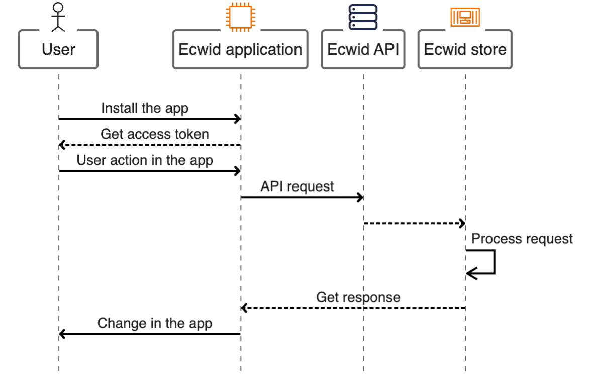

# What is an Ecwid app

**Ecwid application** is an extension users can install to their Ecwid stores. Developers can provide Ecwid users with **any functionality** through applications with dev time and knowledge being the only limitations.

Ecwid applications **do not host the code**. Instead, apps serve as a dev's platform where they can manage available app features and get access to the data of specific stores.

To get a better understanding of what you can do with Ecwid apps, check out the following articles:


[ecwid-api-features.md](../ecwid-api-features.md)



[app-settings.md](app-settings.md)


### How Ecwid apps work with API

<figure><figcaption></figcaption></figure>

Applications start working with Ecwid API when they are installed in the store. As a result, the app gets **access tokens** allowing it to access store data through API requests.

With tokens, the app becomes functional. Now the store owner can interact with the app through some form of UI, and the app's logic can transform user actions into working API requests.

