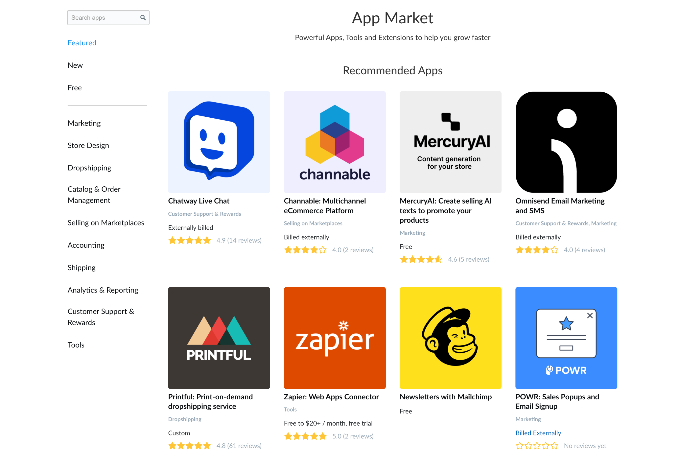

# Public apps overview

**Public applications** can give our clients additional customization tools or add new integrations to their stores. Any custom app can become public. Any developer can come to us and create a public app. We always welcome new additions to our [App Market](https://www.ecwid.com/apps)!

**App Market** is a place where clients can search and install public apps in their stores. It has a search tool, collections, and categories to make it easier to find specific apps.

<figure><figcaption></figcaption></figure>

We have an automated flow where you start with only an idea of an app and end up with it being published in the App Market.&#x20;

Start with the dev version of your app in the free dev environment and test it with us before publishing the app.

<table data-card-size="large" data-view="cards"><thead><tr><th></th><th data-type="content-ref"></th></tr></thead><tbody><tr><td><strong>Start developing with Ecwid</strong></td><td><a href="steps-to-go-live-with-a-public-app/">steps-to-go-live-with-a-public-app</a></td></tr><tr><td><strong>Get revenue</strong></td><td><a href="monetize-public-apps.md">monetize-public-apps.md</a></td></tr></tbody></table>

